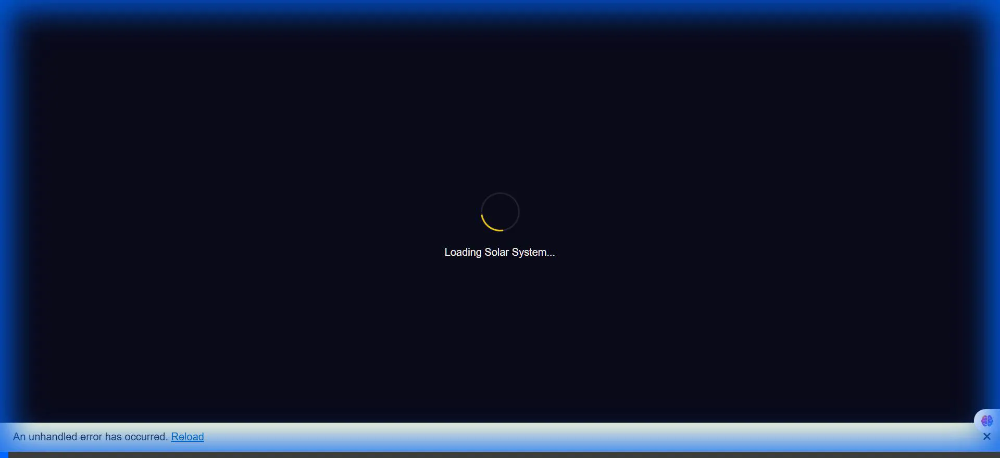

# Solar System Explorer 🪐

A full-stack, 3D interactive Solar System visualization built with .NET 8 (Blazor WebAssembly), Three.js, and Supabase.



## 🚀 Quick Start

### Prerequisites
- [Docker Desktop](https://www.docker.com/products/docker-desktop)
- [.NET 8 SDK](https://dotnet.microsoft.com/download/dotnet/8.0)

### Running Locally (Docker)

To run the application in a production-like containerized environment locally:

```bash
# 1. Build the image
docker build -t solarsystem:local .

# 2. Run with environment variables
docker run -p 8080:8080 \
  -e ConnectionStrings__DefaultConnection="Host=db.iynbzpfgcvzpotjhqyls.supabase.co;Port=5432;Database=postgres;Username=postgres;Password=YOUR_PASSWORD;SSL Mode=Require;Trust Server Certificate=true" \
  -e NasaApi__ApiKey="YOUR_NASA_API_KEY" \
  solarsystem:local
```

> **Note:** Replace `YOUR_PASSWORD` and `YOUR_NASA_API_KEY` with your actual credentials.

Open [http://localhost:8080](http://localhost:8080) to view the app.

### Running Locally (Development)

1. Clone the repository
2. Set user secrets (recommended) or update `src/SolarSystem.Api/SolarSystem.Api/Properties/launchSettings.json` with your credentials.
3. Run the API:

```bash
cd src/SolarSystem.Api/SolarSystem.Api
dotnet run
```

## 📚 Documentation

- [Deployment Guide (Kubernetes & Azure)](docs/DEPLOYMENT.md)
- [Supabase Setup](docs/SUPABASE_SETUP.md)
- [Kubernetes Setup](docs/KUBERNETES_SETUP.md)

## 🏗 Architecture

- **Frontend:** Blazor WebAssembly + Three.js for 3D rendering
- **Backend:** ASP.NET Core Web API 8
- **Database:** PostgreSQL (Supabase) + Entity Framework Core
- **Real-time:** SignalR for simulation state sync
- **Infrastructure:** Docker, Kubernetes (AKS), Azure Container Registry

## 🛠 Project Structure

- `src/SolarSystem.Api` - Backend API & Server
- `src/SolarSystem.Api.Client` - Blazor WebAssembly Client
- `src/SolarSystem.Shared` - Shared models & DTOs
- `k8s/` - Kubernetes manifests
- `docs/` - Technical documentation
